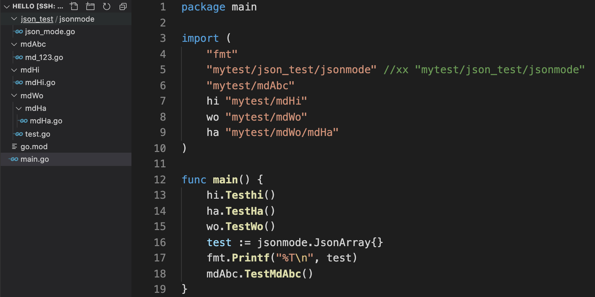
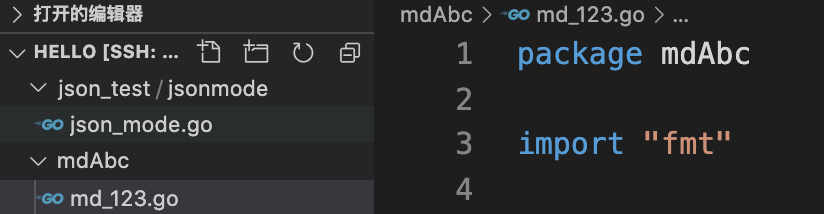
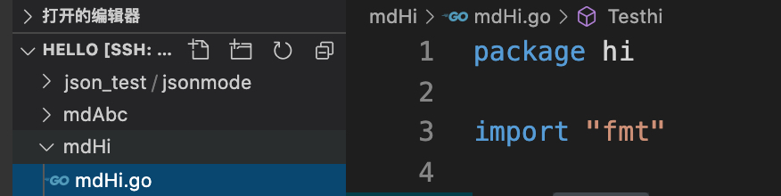
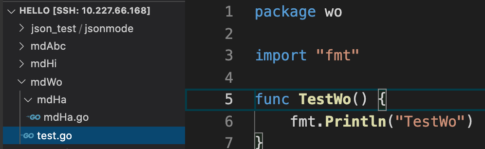
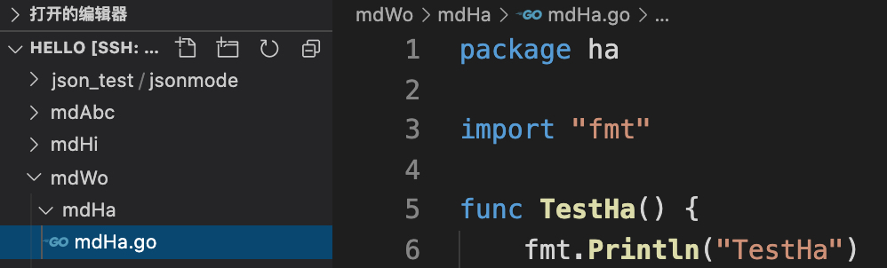

# [Go的目录结构以及如何引用自己写的包](https://www.cnblogs.com/realjimmy/p/13776138.html)

# 一、 目录结构

**1）在gopath模式下**

作为一个workspace,需要包含src、pkg、bin三个目录

  

workspace(/root/code/go)

|-- src //源码目录（自己写的工程，或是go get获取的工程）

        |-- 我的工程

                |--vendor //可选，该工程依赖的三方包

|-- pkg //编译生成的静态包文件（一般为.a文件）

|-- bin //go可执行工具目录（执行go install后会复制到此目录下）

  

设置环境变量：

export GOPATH=/root/code/go

export GOROOT=/usr/local/go

export PATH=$PATH:$GOROOT/bin:$GOPATH/bin

  

源码：必须放在src目录下

依赖包：放在src目录下（一般通过go get获取），或是放在”我的工程“目录下自己新建的vendor目录里。

  

**2）在go mod模式下**

源码可以放在任意地方，go mod依赖包会先下载到pkg目录，保存为cach文件再解压，以包名+版本号进行版本区分，如grpc@v1.28.0

源码：任意位置

依赖包：告别vendor目录，通过go mod管理，会下载到pkg目录下。

  

**go mod常用命令**

*   go mod init # 初始化当前目录为模块根目录，生成go.mod, go.sum文件
*   go mod download # 下载依赖包
*   go mod tidy #整理检查依赖，如果缺失包会下载或者引用的不需要的包会删除
*   go mod vendor #复制依赖到vendor目录下面
*   go mod 可看完整所有的命令
*   go mod graph 以文本模式打印模块需求图
*   go mod verify 验证依赖是否正确
*   go mod edit 编辑go.mod文件

# 二、引用自定义包

**引用自定义包实例：**

这里go mod init mytest，故意将module名和目录配置不一样。

```plain
root# cat go.mod

module mytest

go 1.14
```

工程目录结构如下：



例1：import "mytest/mdAbc"



mytest为go mod 的module名

./mdAbc目录名和包同名

直接import "mytest/mdAbc"

例2：import "mytest/json\_test/jsonmode"


mytest为go mod 的module名

./json\_test包名和子目录同名，都是jsonmode，因此直接import "mytest/json\_test/jsonmode"

当然也可以取别名的方式：xx "mytest/json\_test/jsonmode"

例3：import hi "mytest/mdHi"

目录./mdHi和包（hi）不同名，只能以取别名的方式import



例4：import wo "mytest/mdWo"

目录./mdWo和包（wo）不同名，只能以取别名的方式import



例5：import ha "mytest/mdWo/mdHa"

目录./mdWo/mdHa和包（ha）不同名，只能以取别名的方式import



posted @ 2020-10-07 01:39  [一觉醒来写程序](https://www.cnblogs.com/realjimmy/)  阅读(2588)  评论(0)  [编辑](https://i.cnblogs.com/EditPosts.aspx?postid=13776138)  [收藏](javascript:)  [举报](javascript:)

努力加载评论中...

[刷新评论](javascript:)[刷新页面](#)[返回顶部](#top)

 [](https://cloud.baidu.com/campaign/2022/index.html?track=cp:bokeyuan|pf:pc|pp:H-bokeyuan-22xinchun-bokeneiyebowenxiafangC2-cpa|pu:22xinchun-bokeneiyebowenxiafangC2-cpa|ci:22xinchun|kw:10549393)