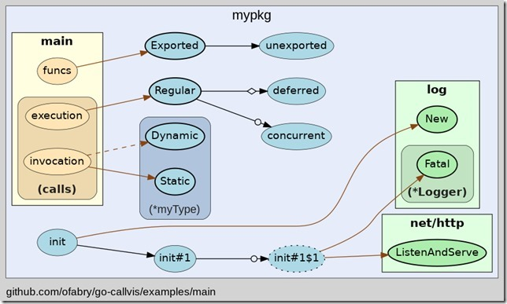
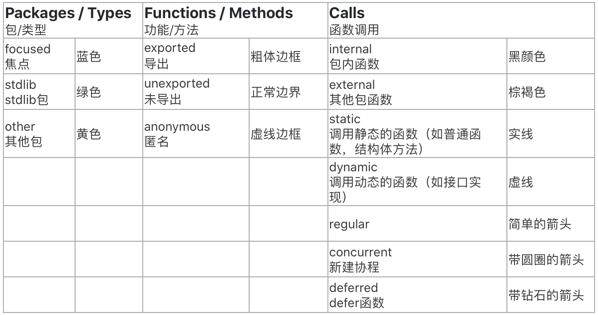

# [go-callvis：Go调用关系图（call graph）](https://www.cnblogs.com/realjimmy/p/13775842.html)

# 一、简介

用过SourceInsight、understand等软件的同学一定知道call graph的功能，转go开发后我用的是vscode和goland，一直在寻找调用关系图的功能。本文介绍的是go-callvis的使用。官网：[https://github.com/ofabry/go-callvis](https://github.com/ofabry/go-callvis)

**功能说明：**

*   支持Go模块！
*   重点关注程序中的特定程序包
*   单击程序包以使用[交互式查看器](https://github.com/ofabry/go-callvis#interactive-viewer)快速切换焦点
*   功能分组：按包和（或）方法类型
*   通过路径前缀过滤包
*   可选忽略标准库中的函数
*   可选忽略各种类型的函数调用

**运行要求：**

*   go 版本：1.13+
*   [Graphviz](http://www.graphviz.org/download/)（可选，仅带-graphviz标志才需要）

注：我在使用时发现对于使用了cgo的包分析时效果不好。

# 二、使用说明

## 2.1 快速安装

go get -u github.com/ofabry/go-callvis # or git clone https://github.com/ofabry/go-callvis.git cd go-callvis && make install

## 2.2 使用说明

go-callvis \[可选参数\] <包路径>

**1）使用浏览器交互展示**

默认情况下，HTTP服务器在http://localhost:7878/上侦听，请使用选项-http="ADDR:PORT"更改HTTP服务器地址。

**2）静态输出**

要生成单个输出文件，使用选项-file=<file path>选择输出文件目标。

输出格式默认为svg，使用选项-format=<svg|png|jpg|...>选择其他输出格式。

**3）其他参数**

\-debug  
         输出详细日志  
   -file string  
         以文件新式输出结果，并将忽略server交互模式  
   -focus string  
         Focus specific package using name or import path. (default "main")  
   -format string  
         输出文件的格式 \[svg | png | jpg | ...\] (默认 "svg")  
   -graphviz  
         使用Graphviz渲染图像  
   -group string  
         分组功能，根据包 与/或 类型分组 \[pkg, type\] (用逗号分开) (默认 "pkg")，例如 -group pkg,type  
   -http string  
         HTTP 服务地址 (默认 ":7878")  
   -ignore string  
        忽略包含给定前缀的包路径(用逗号分开)  
   -include string  
         包含具有给定前缀的包路径 (用逗号分开)  
   -limit string  
         Limit package paths to given prefixes (separated by comma)  
   -minlen uint  
         Minimum edge length (for wider output). (default 2)  
   -nodesep float  
         Minimum space between two adjacent nodes in the same rank (for taller output). (default 0.35)  
   -nointer  
         忽略对未导出函数的调用。  
   -nostd  
         忽略标准库的调用  
   -skipbrowser  
         跳过打开浏览器  
   -tags build tags  
         a list of build tags to consider satisfied during the build. For more information about build tags, see the description of build constraints in the documentation for the go/build package  
   -tests  
         包含测试代码  
   -version  
         显示版本号

4、使用示例：  
1）解析main包  
go-callvis -skipbrowser -nostd ./

  
2）解析testPkg包  
go-callvis -group pkg,type -focus testPkg github.com/项目具体路径 

## 2.3 效果图说明

**效果图说明：**

**参考：**

[https://www.lagou.com/lgeduarticle/96545.html](https://www.lagou.com/lgeduarticle/96545.html)

[https://github.com/ofabry/go-callvis](https://github.com/ofabry/go-callvis)

posted @ 2020-10-06 22:45  [一觉醒来写程序](https://www.cnblogs.com/realjimmy/)  阅读(4766)  评论(0)  [编辑](https://i.cnblogs.com/EditPosts.aspx?postid=13775842)  [收藏](javascript:)  [举报](javascript:)

努力加载评论中...

[刷新评论](javascript:)[刷新页面](#)[返回顶部](#top)

**编辑推荐：**  
· [dotnet 替换 ASP.NET Core 的底层通讯为命名管道的 IPC 库](https://www.cnblogs.com/lindexi/p/15847924.html)  
· [浅谈C#可变参数params](https://www.cnblogs.com/wucy/p/15870366.html)  
· [.NET IoT 入门指南：（七）制作一个气象站](https://www.cnblogs.com/zhanggaoxing/p/15870837.html)  
· [\[ASP.NET Core\]设置Web API 响应的数据格式——Produces 特性篇](https://www.cnblogs.com/tcjiaan/p/15865531.html)  
· [记一次最近生产环境项目中发生的两个事故及处理方法](https://www.cnblogs.com/fulongyuanjushi/p/15866055.html)  

  

**最新新闻**：  
· [特斯拉中国设计中心将落户北京 负责打造“国际电动汽车”](https://news.cnblogs.com/n/712588/)  
· [iPad要发货了！苹果零部件短缺问题得到改善：富士康加速生产](https://news.cnblogs.com/n/712587/)  
· [“扎克冲击”：戳破元宇宙，Meta雪崩了](https://news.cnblogs.com/n/712586/)  
· [马斯克刚评上院士就被控虐猴！动保称65%实验用猴被Neuralink虐待处死](https://news.cnblogs.com/n/712585/)  
· [传知乎低调裁员，主要为视频相关部门，几乎裁掉一半](https://news.cnblogs.com/n/712584/)  
» [更多新闻...](https://news.cnblogs.com/ "IT 新闻")